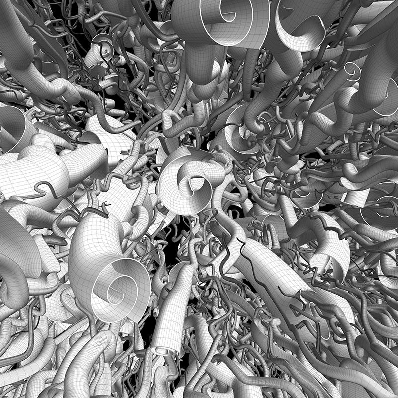
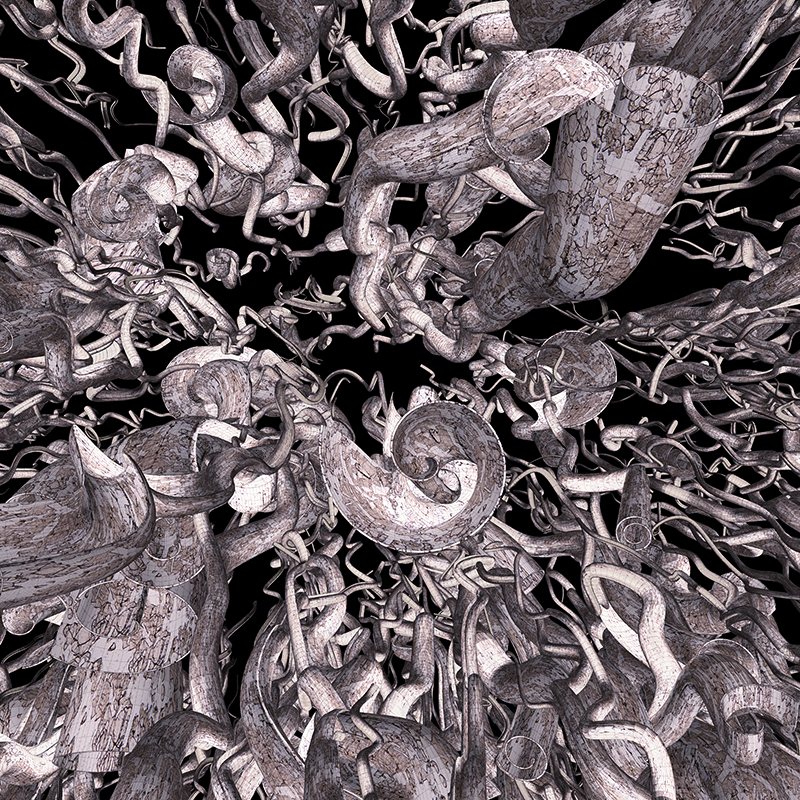

# CornucopiaArt

This project is a processing generator for "Cornucopia Doodles" designed to emulate some of my [manual ink doodles](https://www.coderhood.com/doodle-tuesday-tangle-scrolls/).

## Examples:

## Requirements

- [Processing 3](http://www.processing.org)
- Shape3D processing library.

## Copyright Notice

I reserve the rights to all images generated by this sketch in its current form and any modified form.

You need written permission to use any of the images generated. To obtain it, please contact me using my [Blog's contact form](https://www.coderhood.com/contact/).
